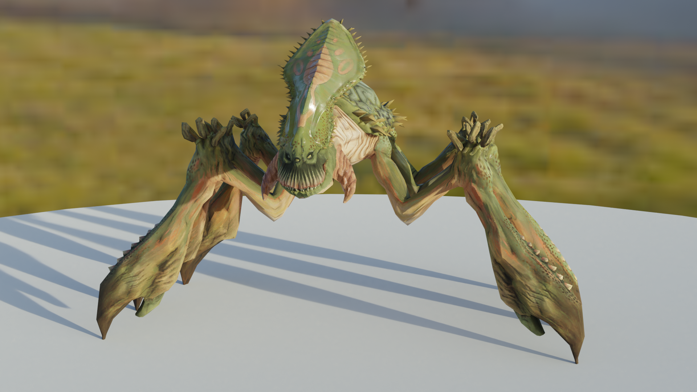

# Blender SWTOR Importer

Import gr2 files from Star Wars: The Old Republic directly into Blender.

## Usage

This simply adds an option to the import menu.

`File > Import > SWTOR Mesh (.gr2)`

If you've never extracted files from the game archives before [this should get you started](https://steamcommunity.com/sharedfiles/filedetails/?id=920585607), enjoy not having to bother with Neosis by importing models directly in Blender 🎉

## Installing

Download the latest release and install it using the Add-ons interface.

`Edit > Preferences... > Add-ons > Install`
